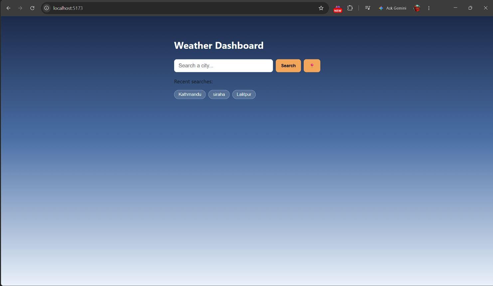
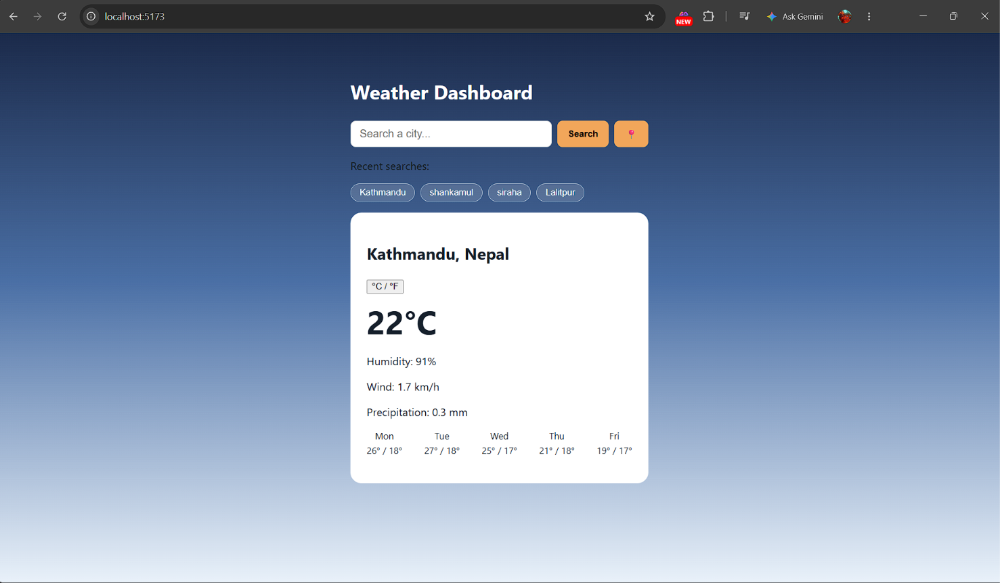
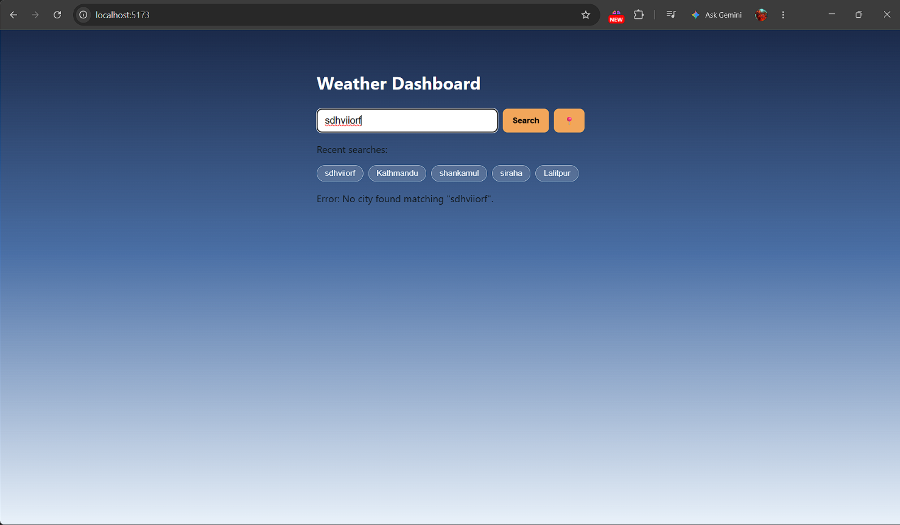

# Weather Dashboard

A single-page React app for looking up the current weather and a 5-day
forecast for any city, with search history, a C/F toggle, and a
"use my location" button.

## Features

- Search any city by name and view live current conditions (temperature,
  condition, humidity, wind, precipitation).
- 5-day forecast with daily high/low.
- Toggle temperature units between C and F.
- "Use my location" button using the browser Geolocation API.
- Recent-search history, persisted in localStorage, click to re-search.
- Loading and error states (e.g. city not found, network error).
- Responsive layout for desktop and mobile widths.

## Technologies Used

- React (functional components + hooks: useState, useEffect, custom
  useWeather hook)
- Vite for tooling/dev server
- Open-Meteo Geocoding + Forecast APIs (free, no API key required) for
  weather data
- Plain CSS (no UI framework)

## Setup

    npm install
    npm run dev

Then open the printed local URL (usually http://localhost:5173).

To build for production:

    npm run build

## Project Structure

    src/
      components/   SearchBar, LoadingSpinner, ErrorMessage, WeatherCard, SearchHistory
      hooks/        useWeather - fetch + loading/error state
      utils/        api.js - geocoding & forecast fetch helpers
      App.jsx       top-level state (history, unit) and layout
      index.css     styles

## Screenshots

**Idle state**

**Search result with 5-day forecast**

**Error state**

## Known Limitations

- Weather data comes from Open-Meteo rather than OpenWeatherMap; both are
  free public weather APIs, and Open-Meteo requires no API key.
- No React Router - the app is intentionally a single view.